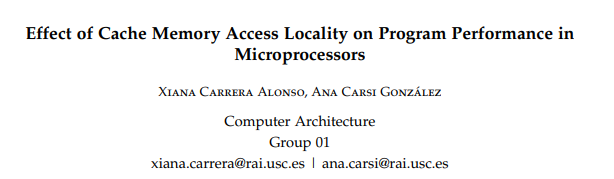

<div align="center">



</div>

<h1 align="center" style="margin-top: 0px;"><b>Cache Locality Performance Study</h1>
<h2 align="center" style="margin-top: 0px;">Computer Architechture</h2>

# Introduction

This project studies the effect of the choice of the access pattern to the elements of an N-dimensional vector on the time cost of reading, as well as the effects of physical parameters of the processor and cache memory.

# Requirements

## Hardware
## Software
-  Ubuntu >= 20.04.4 LTS

# Getting Started
## Clone The Repository

```sh
git clone https://github.com/anacarsi/22ws-CacheLocalityPerformance.git
cd 22ws-CacheLocalityPerformance
```

## Create A Virtual Environment (optional):

### With conda

```sh
conda create -n cachelocal
conda activate cachelocal
```

## Install

### Install the package

```sh
pip install -e .
```

# Citation
```bibtex
@software{llmcoder-hd-24,
    author = {Xiana Carrera and Ana Carsi},
    title = {Cache Locality Performance},
    month = mar,
    year = 2022,
    publisher = {GitHub},
    version = {0.1.0},
    url = {https://github.com/anacarsi/22ws-CacheLocalityPerformance}
}
```

